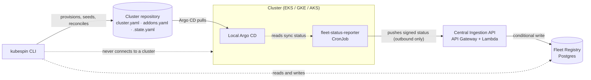
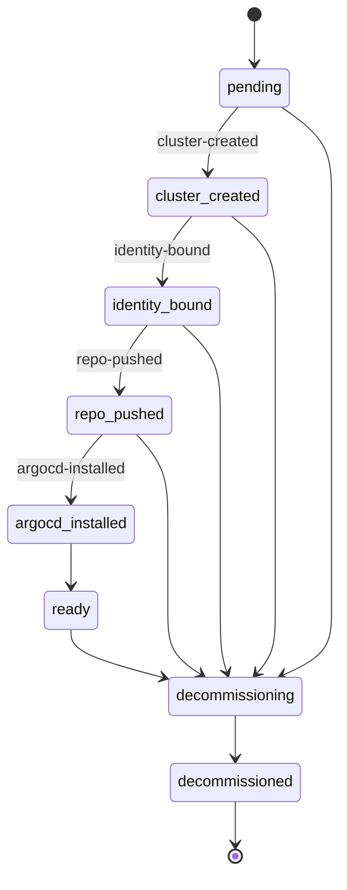

# Architecture

This document covers the decisions that are hard to recover by reading any
single file. For flag-level detail see the [CLI reference](cli/kubespin.md); for
the milestone sequence see
[IMPLEMENTATION-PLAN-multicloud-k8s-platform-cli.md](https://github.com/GitOpsHub/kubespin/blob/main/IMPLEMENTATION-PLAN-multicloud-k8s-platform-cli.md).

## The shape of the system

A conventional multi-cluster platform puts a central Argo CD in a management
account and has it reach into every cluster. kubespin does the opposite, because
that central hub is both a credential-sprawl problem and a single point of
failure: it needs network reachability and admin credentials for every cluster
it manages.

Instead, each cluster runs **its own** Argo CD, syncing from **its own**
repository. Nothing outside a cluster ever connects into it. State travels the
other way: an in-cluster reporter pushes signed status outward.

The consequences are worth stating explicitly, because they constrain nearly
every later decision:

- **A cluster on a private network needs no ingress path for management.** The
  reporter only needs egress to one host.
- **`fleet status` cannot hang on an unreachable cluster.** It reads the
  registry. A cluster that stops reporting is flagged *stale* — a real signal —
  rather than making the command time out.
- **An unreachable cluster does not degrade the others.** There is no shared
  control plane to be blocked on.
- **Authentication is per-cluster and cloud-native.** The reporter signs with
  IRSA, GCP Workload Identity, or an Azure federated credential. No static
  credentials live in a cluster. The ingestion handler must bind the token's
  subject to the `{clusterId}` in the request path — otherwise a signature
  issued to cluster A could be replayed to report status as cluster B.

## The Fleet Registry

Postgres, one row per cluster in a `fleet_registry` table keyed by
`cluster_id`. It is the single source of durable fleet state, and every
component reaches it through `internal/registry` rather than raw SQL. The
client (`registry.Postgres`, in `internal/registry/postgres.go`) self-migrates
this schema idempotently on connect, so there is no separate migration step
and no state to provision ahead of time.

The primary key is `cluster_id` **alone**, deliberately. One row per cluster
means a status report and a phase transition contend on the same row, so the
lease actually serialises them (`AcquireLease` is a conditional `UPDATE` on
that row). A composite key would let them proceed independently and the lock
would protect nothing.

A `(provider, phase)` index exists from the first day the table does, because
`fleet audit` and `fleet update` enumerate by provider and phase, and adding
an index to a populated table is a slow online operation. Every `List` call is
one query filtered by whichever of provider/phase are set — Postgres reads are
always consistent, so unlike the eventually-consistent scan-or-index choice a
DynamoDB-backed registry would face, there is no separate path to pick between
or paginate through.

The database itself can be hosted anywhere reachable over the network — kubespin
does not require it to be AWS-hosted. `fleet bootstrap` provisions the AWS-side
Central Ingestion API only; the operator provisions Postgres separately and
supplies its connection string via `KUBESPIN_REGISTRY_DSN`.

A second table, `cluster_argocd_details`, holds one upserted row per cluster
of its Argo CD connection details (LoadBalancer endpoint, admin username,
plaintext password) — foreign-keyed to `fleet_registry(cluster_id)` with
`ON DELETE CASCADE` so a decommissioned cluster's row disappears with it.
`apply` captures into it automatically every time a cluster reaches
`ready`, via `internal/registry`'s `RecordArgoCDAccess`/`GetArgoCDAccess`
(see [internal/registry](reference/registry.md)).

### The phase state machine

Defined in [internal/core/phase.go](https://github.com/GitOpsHub/kubespin/blob/main/internal/core/phase.go). Transitions are
validated on every write, so an illegal move fails at the storage boundary
instead of being silently persisted.

Three rules govern transitions, in precedence order:

1. **A phase may always transition to itself.** The orchestrator re-writes its
   current phase on retry, and that has to be an idempotent no-op rather than an
   error. This is what makes retry and first run the same code path.
2. **Any live phase may enter `decommissioning`.** A cluster that failed halfway
   through provisioning still has to be tearable-down.
3. **Otherwise only the single forward step is legal** — no skipping, no
   rollback.

Validity is derived from `PhaseOrder`, not from the transition table: `ready` is
a perfectly valid phase to be in despite having no forward successor.

### The lease

Provisioning is serialised by a lease on the cluster's registry item
([internal/registry](https://github.com/GitOpsHub/kubespin/tree/main/internal/registry)): a conditional write that succeeds
only when the lease is free, expired, or already the caller's. Two `apply` runs
against the same cluster cannot both proceed — the second is refused.

The lease **expires** rather than being held until released. A run that crashes
mid-provision must not wedge a cluster forever, so the claim self-heals once the
TTL passes. Two consequences follow:

- **The orchestrator renews before each step**, so the TTL only has to outlast
  the longest single step, not an entire 30-minute provisioning run.
- **Renewing an expired lease fails.** By then another holder may already own
  it, and silently re-acquiring would defeat the lock.

## Sequencing a run

[internal/orchestrator](https://github.com/GitOpsHub/kubespin/tree/main/internal/orchestrator) turns the state machine into
an actual run: acquire the lease, then walk the phases, recording each in the
registry only *after* its step succeeds.

That ordering is what makes a run resumable. A failure leaves the cluster at its
last completed phase; the next run reads that phase and re-enters there, so
retry and first run are the same code path rather than a special case. It also
means a step must be safe to re-run, since the step that failed is the one the
retry executes first.

The record is re-read after the lease is acquired, not before: between the two,
another run may have advanced the cluster, and resuming from the earlier phase
would repeat work already done.

## The cluster repository contract

Each cluster's repository holds three files whose roles must stay distinct:

| File | Role | A change here means |
|---|---|---|
| `cluster.yaml` | Desired infrastructure: provider, region, access mode, node pools | A cloud SDK call |
| `addons.yaml` | Resolved addon set: profile plus override patch, flattened | A commit, synced by Argo CD |
| `.state.yaml` | Hash of last-applied desired state; not user-authored | Nothing directly — it is how the diff is computed |

`apply` is **split-diff**: clone the repository, hash desired state against
`.state.yaml`, then route each difference to the right side. A node pool resize
triggers a cloud reconcile and no commit; an addon version bump triggers a
commit and no cloud call; no change at all produces neither.

That last case is a hard requirement, not an optimisation — it is what makes
`apply` safe to run on a schedule. It also means `.state.yaml` must hash a
*canonicalised* form (stable key ordering, normalised defaults), or serialisation
noise will read as drift.

Addons are delivered app-of-apps: one root Argo CD Application discovers one
Application per addon, so addons sync and fail independently — the manifests
are rendered by [internal/argocd](https://github.com/GitOpsHub/kubespin/tree/main/internal/argocd) and committed with the
rest of the repository seed.

Installing Argo CD itself into the cluster is the one step of this that is
**not yet implemented**: `ProvisioningSteps` leaves the `argocd-installed`
phase a no-op, so a run reaches `ready` with a real cluster, a real workload
identity, and a seeded repository, but nothing syncing yet. When it lands it
will go through the Helm Go library, never by shelling out to `helm` or
`kubectl`; what blocks it is acquiring a `*rest.Config` for a freshly created
cluster, which needs a per-cloud token scheme (see
[docs/README.md](README.md#open-questions)).

## Access mode is a first-class field

`Access: private | public` lives on `ClusterSpec`
([internal/core/cluster.go](https://github.com/GitOpsHub/kubespin/blob/main/internal/core/cluster.go)), not in a per-cloud
options bag, because it branches behaviour in two places that must agree:

- **At creation**, it selects endpoint and authorized-network configuration,
  differently on each of the three clouds.
- **At addon templating**, it decides load balancer exposure — internal unless
  the cluster is `public` *and* the ingress explicitly asks to be external.

A Kyverno public-exposure-deny policy enforces the same rule at admission, so a
misconfigured default is caught by the cluster rather than by a reviewer.
`AuthorizedCIDRs` is rejected on a private cluster: there is no public endpoint
to restrict, and silently accepting the field would imply otherwise.

## Provisioning is interface-first

`ClusterProvisioner` (`Create`/`Describe`/`Reconcile`/`Delete`) and
`IdentityProvisioner` (`ProvisionForComponent`) are shared interfaces with one
implementation per cloud under `internal/provisioner/{aws,gcp,azure}`. No cloud
conditionals leak into command or catalog code.

Three shape decisions matter more than they look:

- **Cluster creation is asynchronous.** It takes 10–30 minutes on every cloud, so
  `Create` returns as soon as the request is accepted and the caller polls
  `Describe`. A blocking call that outlives its lease is a bug generator. It
  follows that `Describe` returns *absent* rather than an error for a cluster
  that does not exist — "not there yet" is a normal answer while polling.
- **`Reconcile` reports "already correct" as data**, not by the caller diffing
  before-and-after state. The no-op guarantee above depends on being able to
  prove nothing happened.
- **Workload identity is its own phase**, not part of creation. The cluster's
  OIDC issuer does not exist until the control plane is up, so nothing can be
  bound to it before then.

`Reconcile` never deletes a node pool. Removing one evicts running workloads,
which is a decision for a human rather than something a loop does because a file
changed.

The identity a component gets exists to be **proven**, not to grant cloud
access: the status reporter signs its push with it and the ingestion API
verifies the signature. That is why `Component` carries no permission set. On
AWS the IRSA trust policy is scoped by both `sub` and `aud` — without `sub` any
service account in the cluster could assume the role, and without `aud` a token
minted for another audience would be accepted.

## Convergence without a state file

Fleet infrastructure — the ingestion API (the Fleet Registry is a separately
operated Postgres database, not part of this) — is provisioned by
[internal/fleetinfra](https://github.com/GitOpsHub/kubespin/tree/main/internal/fleetinfra) through `aws-sdk-go-v2`, not
Terraform or CloudFormation. One language, one toolchain, and the stack is
unit-testable with `go test` like everything else.

What a state file was providing has to be replaced by properties that are
actually asserted:

- **`Plan` is strictly read-only.** `--dry-run` is the same code path with the
  `Apply` calls skipped — not a parallel branch that rots. The test fakes fail if
  a dry run makes any mutating call.
- **No step ever deletes.** There is no destroy path. Tearing down fleet
  infrastructure is a deliberate manual act; any deletion protection on the
  Postgres instance itself is the operator's responsibility, outside
  `fleet bootstrap`'s scope.
- **A second run must report nothing.** Every step is create-or-update, and
  `TestConverge_SecondRunIsNoOp` asserts that converging already-provisioned
  infrastructure produces no actions *and* no mutating calls. Drift tests go
  further: after repairing drift, a third run must be clean again.
- **The account guard replaces `allowed_account_ids`.** `sts:GetCallerIdentity`
  must match the configured fleet account before any step runs.

Each AWS service is reached through a narrow interface declared in
[internal/fleetinfra/clients.go](https://github.com/GitOpsHub/kubespin/blob/main/internal/fleetinfra/clients.go) listing only
the calls this package makes. That is what makes the engine testable without
credentials, and it doubles as the exact permission set an operator needs — see
the [bootstrap runbook](fleet-bootstrap.md#permissions-the-operator-needs).

## Rate limits are designed in, not bolted on

Fleet-wide operations eventually touch every cluster's repository. The
rate-limited GitHub client belongs in `internal/repo` from the first call, not
retrofitted once a fleet has grown — by then every call site has to be found and
changed.
