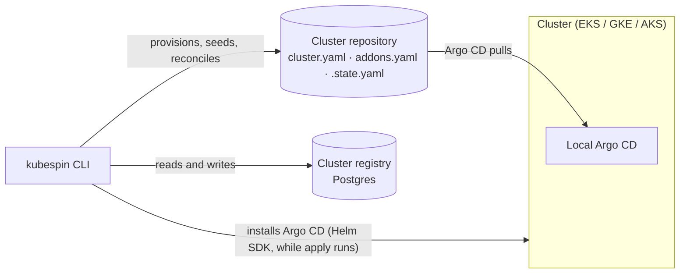
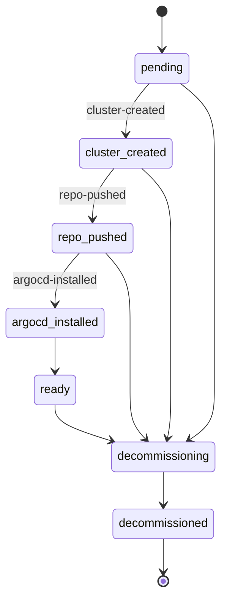

# Architecture

This document covers the decisions that are hard to recover by reading any
single file. For flag-level detail see the [CLI reference](cli/kubespin.md); for
the package layout see [Code organization](code-organization.md).

## The shape of the system

A conventional multi-cluster platform puts a central Argo CD in a management
account and has it reach into every cluster. kubespin does the opposite, because
that central hub is both a credential-sprawl problem and a single point of
failure: it needs network reachability and admin credentials for every cluster
it manages.

Instead, each cluster runs **its own** Argo CD, syncing from **its own**
repository. There is no always-on kubespin service and nothing kubespin-owned
runs inside a cluster: the CLI connects directly, from the operator's machine,
only while a command is running.

The consequences are worth stating explicitly, because they constrain nearly
every later decision:

- **Nothing runs between commands.** No agent, no controller, no scheduled
  push. Anything kubespin knows about a cluster it learned while a command was
  running, and wrote to the registry.
- **An unreachable cluster does not degrade the others.** There is no shared
  control plane to be blocked on.
- **A private cluster needs the operator's machine to be able to reach it.**
  `apply` installs Argo CD over the Kubernetes API, so `--access private`
  assumes a VPN, peering, or bastion is already in place.

## The cluster registry

Postgres, one row per cluster in a `fleet_registry` table keyed by
`cluster_id`. It is the single source of durable per-cluster state, and every
component reaches it through `internal/registry` rather than raw SQL. The
client (`registry.Postgres`, in `internal/registry/postgres.go`) self-migrates
this schema idempotently on connect, so there is no separate migration step
and no state to provision ahead of time.

The primary key is `cluster_id` **alone**, deliberately. One row per cluster
means every write about a cluster contends on the same row, so the lease
actually serialises them (`AcquireLease` is a conditional `UPDATE` on that
row). A composite key would let writers proceed independently and the lock
would protect nothing.

A `(provider, phase)` index exists from the first day the table does, because
adding an index to a populated table is a slow online operation. Every `List`
call is one query filtered by whichever of provider/phase are set.

The database itself can be hosted anywhere reachable over the network — the
operator provisions Postgres and supplies its connection string via
`KUBESPIN_REGISTRY_DSN`. There is no separate provisioning step: the client
migrates the schema itself on first connect.

A second table, `cluster_argocd_details`, holds one upserted row per cluster
of its Argo CD connection details (LoadBalancer endpoint, admin username,
plaintext password) — foreign-keyed to `fleet_registry(cluster_id)` with
`ON DELETE CASCADE` so a decommissioned cluster's row disappears with it.
`apply` captures into it automatically every time a cluster reaches
`ready`, via `internal/registry`'s `RecordArgoCDAccess`/`GetArgoCDAccess`
(see [internal/registry](reference/registry.md)).

### The phase state machine

Defined in [internal/core/phase.go](https://github.com/GitOpsHub/kubespin/blob/main/internal/core/phase.go). Transitions are
validated on every write, so an illegal move fails at the storage boundary
instead of being silently persisted.

Three rules govern transitions, in precedence order:

1. **A phase may always transition to itself.** The orchestrator re-writes its
   current phase on retry, and that has to be an idempotent no-op rather than an
   error. This is what makes retry and first run the same code path.
2. **Any live phase may enter `decommissioning`.** A cluster that failed halfway
   through provisioning still has to be tearable-down.
3. **Otherwise only the single forward step is legal** — no skipping, no
   rollback.

Validity is derived from `PhaseOrder`, not from the transition table: `ready` is
a perfectly valid phase to be in despite having no forward successor.

### The lease

Provisioning is serialised by a lease on the cluster's registry item
([internal/registry](https://github.com/GitOpsHub/kubespin/tree/main/internal/registry)): a conditional write that succeeds
only when the lease is free, expired, or already the caller's. Two `apply` runs
against the same cluster cannot both proceed — the second is refused.

The lease **expires** rather than being held until released. A run that crashes
mid-provision must not wedge a cluster forever, so the claim self-heals once the
TTL passes. Two consequences follow:

- **The orchestrator renews before each step**, so the TTL only has to outlast
  the longest single step, not an entire 30-minute provisioning run.
- **Renewing an expired lease fails.** By then another holder may already own
  it, and silently re-acquiring would defeat the lock.

## Sequencing a run

[internal/orchestrator](https://github.com/GitOpsHub/kubespin/tree/main/internal/orchestrator) turns the state machine into
an actual run: acquire the lease, then walk the phases, recording each in the
registry only *after* its step succeeds.

That ordering is what makes a run resumable. A failure leaves the cluster at its
last completed phase; the next run reads that phase and re-enters there, so
retry and first run are the same code path rather than a special case. It also
means a step must be safe to re-run, since the step that failed is the one the
retry executes first.

The record is re-read after the lease is acquired, not before: between the two,
another run may have advanced the cluster, and resuming from the earlier phase
would repeat work already done.

## The cluster repository contract

Each cluster's repository holds three files whose roles must stay distinct:

| File | Role | A change here means |
|---|---|---|
| `cluster.yaml` | Desired infrastructure: provider, region, access mode, node pools | A cloud SDK call |
| `addons.yaml` | Resolved addon set: profile plus override patch, flattened | A commit, synced by Argo CD |
| `.state.yaml` | Hash of last-applied desired state; not user-authored | Nothing directly — it is how the diff is computed |

`apply` is **split-diff**: clone the repository, hash desired state against
`.state.yaml`, then route each difference to the right side. A node pool resize
triggers a cloud reconcile and no commit; an addon version bump triggers a
commit and no cloud call; no change at all produces neither.

That last case is a hard requirement, not an optimisation — it is what makes
`apply` safe to run on a schedule. It also means `.state.yaml` must hash a
*canonicalised* form (stable key ordering, normalised defaults), or serialisation
noise will read as drift.

Addons are delivered app-of-apps: one root Argo CD Application discovers one
Application per addon, so addons sync and fail independently — the manifests
are rendered by [internal/argocd](https://github.com/GitOpsHub/kubespin/tree/main/internal/argocd) and committed with the
rest of the repository seed.

Installing Argo CD itself into the cluster is handled by `installArgoCDStep`
in [internal/orchestrator](https://github.com/GitOpsHub/kubespin/tree/main/internal/orchestrator).
It acquires a `*rest.Config` for the freshly created cluster via
`provisioner.RESTConfigProvisioner` — implemented by every cloud's
`ClusterProvisioner` (a presigned STS token on AWS, an Application Default
Credentials OAuth token on GCP, the kubeconfig `ListClusterUserCredentials`
returns on Azure) — then installs Argo CD through the Helm Go library
(`argocd.HelmInstaller`, never by shelling out to `helm` or `kubectl`),
applies the self-referential root Application directly via `argocd.KubeApplier`
(client-go dynamic client, server-side apply — never committed to the repo it
manages), and reconciles the per-addon app-of-apps manifests so they are
committed and discoverable by the root Application.

## Access mode is a first-class field

`Access: private | public` lives on `ClusterSpec`
([internal/core/cluster.go](https://github.com/GitOpsHub/kubespin/blob/main/internal/core/cluster.go)), not in a per-cloud
options bag, because it branches behaviour in two places that must agree:

- **At creation**, it selects endpoint and authorized-network configuration,
  differently on each of the three clouds.
- **At addon templating**, it decides load balancer exposure — internal unless
  the cluster is `public` *and* the ingress explicitly asks to be external.

A Kyverno public-exposure-deny policy enforces the same rule at admission, so a
misconfigured default is caught by the cluster rather than by a reviewer.
`AuthorizedCIDRs` is rejected on a private cluster: there is no public endpoint
to restrict, and silently accepting the field would imply otherwise.

## Provisioning is interface-first

`ClusterProvisioner` (`Create`/`Describe`/`Reconcile`/`Delete`) and
`NetworkProvisioner` (`EnsureNetwork`/`DeleteNetwork`) are shared interfaces
with one implementation per cloud under `internal/provisioner/{aws,gcp,azure}`.
No cloud conditionals leak into command or catalog code.

Three shape decisions matter more than they look:

- **Cluster creation is asynchronous.** It takes 10–30 minutes on every cloud, so
  `Create` returns as soon as the request is accepted and the caller polls
  `Describe`. A blocking call that outlives its lease is a bug generator. It
  follows that `Describe` returns *absent* rather than an error for a cluster
  that does not exist — "not there yet" is a normal answer while polling.
- **`Reconcile` reports "already correct" as data**, not by the caller diffing
  before-and-after state. The no-op guarantee above depends on being able to
  prove nothing happened.
- **Workload identity is bound after the control plane is up.** On AWS every
  add-on that needs AWS permissions gets them through EKS Pod Identity. The
  association names a namespace and service account and needs a live cluster,
  so these roles are bound during the cluster reconcile rather than alongside
  the create request.

`Reconcile` never deletes a node pool. Removing one evicts running workloads,
which is a decision for a human rather than something a loop does because a file
changed.

On AWS each add-on role trusts only `pods.eks.amazonaws.com`. Which pod can
use a role is decided by its Pod Identity association, which names one
service account in one namespace of one cluster. The trust policy doesn't
have to encode that, and there's no IAM OIDC provider to register or clean up.

## Convergence without a state file

Every cloud resource kubespin creates is provisioned through each cloud's own
Go SDK, not Terraform or CloudFormation. One language, one toolchain, and the
whole thing is unit-testable with `go test` like everything else.

What a state file was providing has to be replaced by properties that are
actually asserted:

- **A dry run is strictly read-only.** `--dry-run` is the same code path with
  the mutating calls skipped — not a parallel branch that rots. The test fakes
  fail if a dry run makes any mutating call.
- **Nothing is deleted except by `delete`.** `apply` is create-or-update
  throughout: `Reconcile` never removes a node pool, and `EnsureNetwork` adopts
  what its deterministic naming already finds rather than replacing it.
- **A second run must report nothing.** Every step is create-or-update, and a
  no-change `apply` makes no cloud calls and produces no commits.

Each cloud service is reached through a narrow interface declared in the
provisioner package (`internal/provisioner/{aws,gcp,azure}`) listing only the
calls kubespin makes. That is what makes the provisioners testable without
credentials, and it doubles as the exact permission set an operator needs.

## Rate limits are designed in, not bolted on

Every `apply` and `delete` touches a cluster's repository, and an operator
running them back to back across many clusters hits GitHub's API limits. The
rate-limited GitHub client belongs in `internal/repo` from the first call, not
retrofitted once that starts happening — by then every call site has to be
found and changed.
