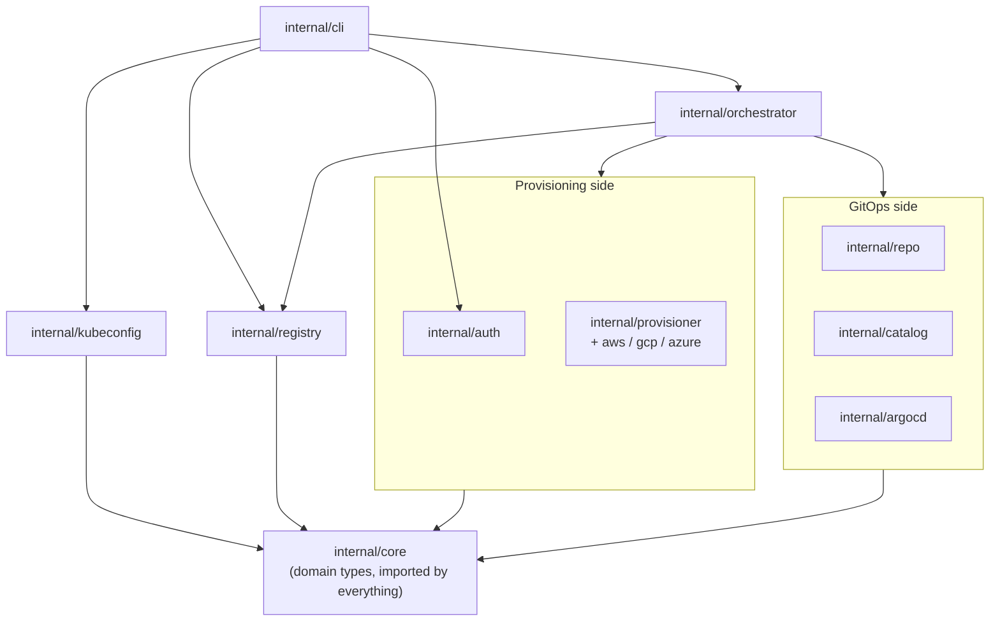

# Code organization

This page maps the repository's packages to what they're responsible for and
how they depend on each other. For *why* the system is shaped this way, see
[Architecture](architecture.md). For method-level detail on any package below,
see the [code reference](reference/index.md).

## Directory layout

```text
cmd/kubespin/                 main() — delegates entirely to internal/cli.NewRootCommand

internal/cli/                 cobra command tree: apply, delete, login, status, logout
internal/core/                shared domain types: ClusterID, ClusterSpec, ClusterSize, Profile, AddonRef, Access, NodePool
internal/auth/                operator-facing cloud auth: shells out to aws/gcloud/az
internal/provisioner/{aws,gcp,azure}   ClusterProvisioner + NetworkProvisioner impls (EKS/GKE/AKS)
internal/repo/                RepoProvisioner over GitHub Enterprise (go-github): Exists/Create/Clone/Push/Archive
internal/registry/            cluster registry client + lease/locking
internal/catalog/             size resolution (small/medium/large, fully builtin) + per-cluster override patches
internal/argocd/              app-of-apps manifest rendering, ingress/Gateway access-mode templating, Argo CD install
internal/orchestrator/        per-cluster phase state machine (apply) and reverse teardown (delete)
internal/kubeconfig/          operator kubeconfig update after apply (shells out to aws/gcloud/az)
internal/tools/changeloggen/  derives CHANGELOG.md and next SemVer from Conventional Commits (`make changelog`)
internal/tools/docsgen/       regenerates docs/cli/*.md from the cobra command tree (`make docs`)
internal/version/             build-time version metadata
```

## How a package finds another package

`internal/core` sits at the bottom: it defines `ClusterID`, `ClusterSpec`,
`ClusterSize`, `Profile`, `AddonRef`, and the phase enum, and nothing in
`internal/core` imports anything else in the repo. Every other package
imports it.

Above that, packages split into two groups that don't import each other
directly — they're connected only through `internal/orchestrator`, which is
where a command's actual work happens:

- **Provisioning side** — `internal/provisioner/{aws,gcp,azure}` implement the
  `ClusterProvisioner`/`NetworkProvisioner` interfaces declared in
  `internal/provisioner`. `internal/auth` sits beside these,
  giving `internal/cli` the operator's cloud session before any provisioner
  call is attempted.
- **GitOps side** — `internal/repo` owns the cluster's GitHub repository;
  `internal/catalog` resolves which addons belong in it; `internal/argocd`
  renders the app-of-apps manifests that go into it and performs the
  Helm-SDK install of Argo CD itself.

`internal/orchestrator` drives both sides through one `apply`: it asks a
`ClusterProvisioner` to reconcile infrastructure, then `internal/repo` +
`internal/catalog` + `internal/argocd` to push the addon set — writing a phase
transition to `internal/registry` after each step.

`internal/cli` is the only package that imports command-level packages
(`auth`, `orchestrator`, `kubeconfig`) together — it exists purely to wire
cobra flags to their calls, which is why
[internal/cli's reference doc](reference/cli.md) reads as "which package does
this command call" rather than new logic of its own.



## Where to add new code

- **A new cloud provider** implements `ClusterProvisioner` and
  `NetworkProvisioner` in a new `internal/provisioner/<cloud>` package — `internal/orchestrator` and
  `internal/cli` need no changes, per the architecture invariant that no
  cloud conditionals leak outside `internal/provisioner/*`.
- **A new command** gets its logic in the package that owns the work and a
  thin cobra wrapper in `internal/cli` — anything touching cluster state
  reads and writes through `internal/registry`, never raw SQL.
- **A new addon profile or tier** belongs in `internal/catalog`.
- **A new phase or transition rule** belongs in `internal/core`'s phase state
  machine — `internal/registry` validates against it on every write, so
  changing it there is enough to enforce it everywhere.
